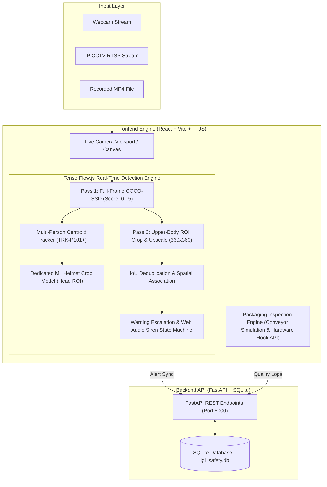
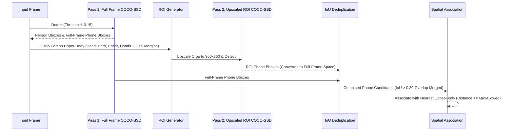

# 🛡️ IGL VisionGuard AI — Industrial Inspection & Safety Intelligence System
## Complete System Architecture, Workflow & Technical Documentation Report

> **Project Name:** IGL VisionGuard AI  
> **Version:** 1.0.0 Production Pipeline  
> **GitHub Repository:** [https://github.com/Shiv-Kumar005023/IGL.git](https://github.com/Shiv-Kumar005023/IGL.git)  
> **Core Stack:** React + Vite (Frontend), FastAPI + SQLite (Backend), TensorFlow.js + COCO-SSD + Custom ML (Computer Vision)

---

## 📋 Executive Summary

**IGL VisionGuard AI** is a production-grade, real-time computer vision and industrial inspection intelligence system built for high-stakes manufacturing, refinery, and conveyor packaging environments.

The platform provides dual operational capabilities:
1. **Industrial Health, Safety & Environment (HSE) Safety Monitoring:** Real-time AI tracking for Person Count, PPE Helmet Enforcement, Mobile Phone Misuse Escalation (with audible siren), and Worker-Vehicle Proximity / Dangerous Zone Boundary Radar.
2. **Conveyor Packaging Quality Control:** High-speed bottle quality inspection covering Liquid Fill Levels, Cap Integrity (Missing/Misaligned/Damaged), and Glass Surface/Body Anomalies with automated reject ejectors.

---

## 🏗️ 1. High-Level System Architecture & Pipeline Flow



---

## 🔍 2. Core AI Vision Engines & Technical Innovations

### 2.1 Person Detection & Zero-Fallback Pipeline
- **Strict Rule:** The person counter displays `0 Persons` when no human is present in the camera frame. Heuristic or dummy fallback values (`|| 1`) have been completely removed.
- **Centroid Multi-Person Tracker:** Tracks individual workers across frames using track IDs (`TRK-P101`, `TRK-P102`, etc.) with a 3000ms max-disappearance memory buffer.

---

### 2.2 Two-Pass Mobile Phone Misuse Detection Engine
COCO-SSD detects mobile phones reliably even when held close to ears/face using a **Two-Pass Architecture**:



- **Warning Escalation State Machine:**
  - **Level 1 (Persistence >= 3 frames, Duration >= 2s):** Initial Warning alert.
  - **Level 2 (Interval 4s):** Second Warning.
  - **Level 3 (Interval 4s):** Critical Warning & **Web Audio Siren Alarm Activation**.

---

### 2.3 Dedicated ML Helmet Verification System
- **Head Crop Tensor Processing:** Crops head ROI (`top 25%` of person box) and resizes to `224x224`.
- **Conservative Safety Default:** Strictly defaults to `hasHelmet: false` if custom model files (`/models/helmet/model.json`) are absent or prediction confidence `< 0.65`.
- **Temporal Grace Period:** Uses `HELMET_PERSISTENCE_FRAMES = 3` and `HELMET_MISS_GRACE_FRAMES = 3` to prevent flickering.

---

## 💻 3. Complete Module-by-Module Walkthrough

### Module 1: Overview Dashboard (`DashboardView.jsx`)
- **Top KPI Cards:** Active Cameras, Unresolved Alerts, PPE Violations, Dangerous Zone Breaches, Near-Miss Warnings, Personnel Anomaly Count, Mobile Phone Violations.
- **Live System Feed & Quick Actions:** Real-time data synchronized with SQLite database every 3 seconds.

---

### Module 2: Camera Setup (`CameraInputView.jsx`)
- **Input Channels:** Webcam Feed, IP CCTV RTSP Stream, MP4 Video File Upload.
- **Mirror View Control:** Interactive `Mirror View (ON / OFF)` toggle for selfie camera horizontal flip.
- **Frame Quality Inspector:** Real-time analysis for resolution, FPS, brightness, blur variance, and camera assessability.

---

### Module 3: Live AI Monitoring (`LiveMonitoringView.jsx`)
- **60 FPS Canvas Rendering:** Decoupled 60 FPS animation loop from ~150ms throttled async TensorFlow inference.
- **Visual Overlays:** Person Bounding Boxes with track IDs (`TRK-P101`), Helmet Status tags, Cell Phone Bboxes, Proximity Distance Lines, Restricted Zone Polygons.
- **AI Debug Inspector:** Real-time live log for Raw AI Predictions, Phone Candidates, and Associated Track IDs.
- **Camera Mirror View:** Toggleable horizontal camera flip with auto-realigned bounding box coordinates.

---

### Module 4: Conveyor Packaging Quality Inspection (`PackagingInspectionView.jsx`)
- **High-Speed Conveyor Viewport:** Animated conveyor belt with moving bottle graphics, 3D laser scanner beam, and real-time fill-level visual indicators.
- **Quad-Inspection Checks:**
  1. **Bottle Detection & ID:** Sequential tracking (`BTL-9840`, `BTL-9841`, etc.).
  2. **Fill-Level Check:** PASS (88–95%), LOW FILL (60–77%), HIGH FILL (98–100%).
  3. **Cap Integrity:** PASS, MISSING, MISALIGNED, DAMAGED.
  4. **Surface & Body Defects:** PASS, SURFACE DEFECT, SHAPE ANOMALY.
- **Overall Decision:** `PASS / ACCEPT` vs `REJECT / DISCARD` (with automated Air-Jet ejector trigger state).
- **Recent Inspection Log Table:** Searchable, filterable log with clickable deep inspection rows.

---

### Module 5: Dangerous Zone & Near-Miss Radar (`NearMissView.jsx`)
- **Dynamic Distance Radar Screen:** Interactive radar displaying real-time distance between vehicles (`Forklift #FLT-09`) and workers on foot (`Worker #104`).
- **Dangerous Zone Boundary Box:** Visual 2.0m perimeter safety box around vehicles and dangerous machinery.
- **Dynamic Distance Slider:** Moving `0.2m (DANGER)` to `3.0m (SAFE)` dynamically shifts worker node position and updates risk status badges (`CRITICAL PROXIMITY BREACH` vs `SAFE DISTANCE OK`).

---

### Module 6: Safety Events & Incident Log (`AlertsView.jsx`)
- **Alert Stream Table:** Shows event types, zone names, severity levels, confidence, timestamps, and status (`DETECTED`, `ACKNOWLEDGED`, `RESOLVED`).
- **Evidence Snapshot Modal:** Clickable base64 photo evidence captured at the moment of violation.

---

### Module 7: Personnel Anomaly Detection (`PersonnelAnomalyView.jsx`)
- **Face / Personnel Recognition:** Checks worker authorization against registered roster.
- **Sleeping on Duty Alert:** Monitors worker pose/inactivity to trigger sleeping alerts.

---

### Module 8: System Analytics & Camera Health (`AnalyticsView.jsx` & `CameraHealthView.jsx`)
- **Analytics Charts:** Historical trend distribution for PPE breaches, phone misuse, and near-miss events.
- **Camera & AI Health Grid:** Online/Offline status, FPS stability, frame brightness, lens occlusion score.

---

### Module 9: Configuration & Geofencing (`ConfigurationView.jsx`)
- **Interactive Geofence Builder:** Polygon ROI boundary drawer for dangerous plant zones (e.g., `High-Voltage Transformer Boundary`).
- **Threshold Adjustment Sliders:** PPE confidence cutoff, zone breach sensitivity, near-miss distance limits.

---

## 🗄️ 4. SQLite Database Schemas & REST API Endpoints

### 4.1 Database Tables (`igl_safety.db`)

#### Table: `alerts`
```sql
CREATE TABLE IF NOT EXISTS alerts (
    id TEXT PRIMARY KEY,
    event_type TEXT NOT NULL,
    zone_name TEXT NOT NULL,
    severity TEXT NOT NULL,
    confidence REAL NOT NULL,
    status TEXT NOT NULL,
    detected_at TEXT NOT NULL,
    evidence_image_base64 TEXT,
    metadata_json TEXT
);
```

#### Table: `cameras`
```sql
CREATE TABLE IF NOT EXISTS cameras (
    id TEXT PRIMARY KEY,
    name TEXT NOT NULL,
    type TEXT NOT NULL,
    status TEXT NOT NULL,
    resolution TEXT NOT NULL,
    fps INTEGER NOT NULL,
    last_seen TEXT NOT NULL
);
```

---

### 4.2 Core REST API Endpoints (`main.py`)

| Method | Endpoint | Description |
| :--- | :--- | :--- |
| `GET` | `/api/dashboard/stats` | Fetches system stats directly from SQLite |
| `GET` | `/api/cameras` | Lists registered camera streams |
| `POST` | `/api/cameras` | Registers new camera or webcam stream |
| `GET` | `/api/alerts` | Fetches active safety alerts |
| `POST` | `/api/alerts` | Creates new alert entry with base64 snapshot |
| `PATCH` | `/api/alerts/{id}/status` | Updates alert status to ACKNOWLEDGED or RESOLVED |

---

## 🚀 5. Local Setup & Execution Guide

### Step 1: Clone Repository
```bash
git clone https://github.com/Shiv-Kumar005023/IGL.git
cd IGL
```

### Step 2: Start Backend Server (Python FastAPI)
```bash
cd backend
python -m venv venv
venv\Scripts\activate   # Windows
pip install fastapi uvicorn sqlite3
python main.py
```
*Backend runs on `http://localhost:8000`*

### Step 3: Start Frontend Server (React + Vite)
```bash
cd frontend
npm install
npm run dev
```
*Frontend runs on `http://localhost:3000`*

---

## 📊 Summary of Recent Pushed Commits

| Commit Hash | Description |
| :--- | :--- |
| **`45f07cb`** | Refactor NearMissView: update label names to Dangerous Zone Boundary Name and Worker Track ID |
| **`85fc5ad`** | Upgrade NearMissView radar with dynamic vehicle safety boundary box & live distance calculation |
| **`7e039e0`** | Add Mirror View toggle button and horizontal flip option to Camera Setup (`CameraInputView`) |
| **`e8ac9e5`** | Add horizontal camera mirroring option with toggle button and auto-aligned bounding boxes |
| **`aa4a1ec`** | Add Packaging Quality Inspection Module (conveyor viewport, fill-level, cap integrity, body defect check) |
| **`5a0296c`** | Implement Two-Pass mobile phone detection architecture in `realVisionProcessor.js` with enlarged ROI crop |

---
*Documentation Generated & Maintained by IGL VisionGuard AI Team.*
